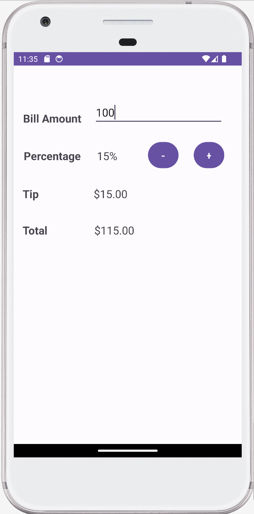
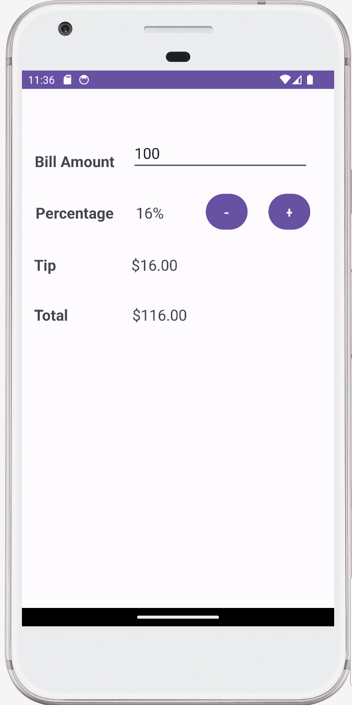
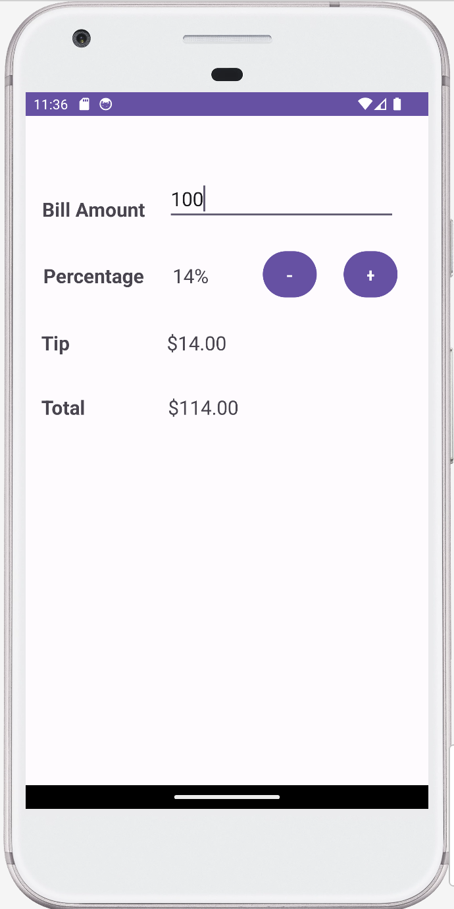
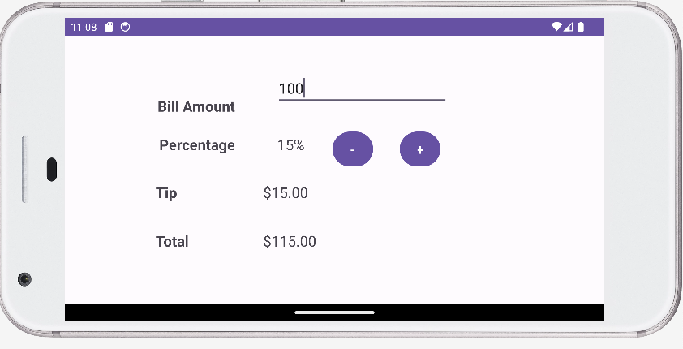

# Tip Calculator App

## User interface when the app starts:

## User types in 100 in the Bill Amount

## User clicks + button one time:

## User clicks - button two times:

## Landscape orientation:

